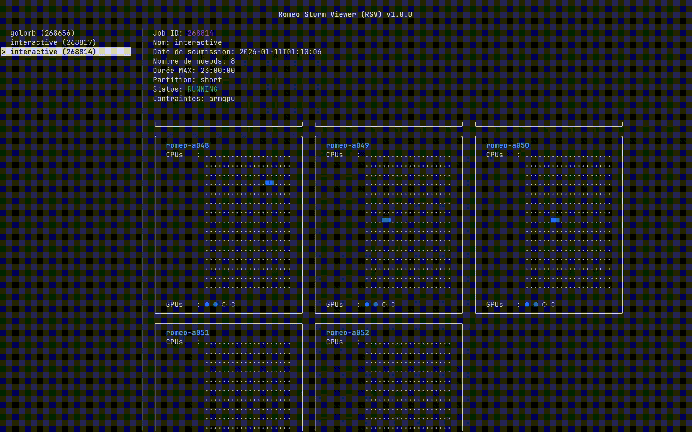

# Romeo Slurm Viewer (RSV)

This small project provides a **Terminal User Interface (TUI)** of your SLURM jobs, showing CPU and GPU allocations per node using characters. It is intended for use on clusters like [ROMEO](https://romeo.univ-reims.fr/).

---

<p align="center">
  
</p>

## Features

- Lists all SLURM jobs for the current user
- Interactive scrolling with mouse wheel
- Auto-refresh every 30 seconds
- UI with a sidebar menu for job selection
- Shows detailed job information:
  - Job ID, Name, Submission time
  - Number of nodes, Elapsed/Max time
  - Partition, Status (color-coded), Constraints
  - Reason decoding with actionable suggestions
- Visualizes node allocations for running jobs:
  - CPU usage (`■` = allocated, `.` = free)
  - GPU usage (`●` = allocated, `○` = free)
  - Dynamic expansion of compressed node lists (e.g., `romeo-a[045-046]`)
  - Nodes grouped by APU type (CPU/GPU architecture)
- Partition view with cluster-wide partition status (like `sinfo`)
- Log viewer, view stdout/stderr files with scrolling or arrows
- Cancel jobs, cancel selected job via `scancel`
- Color-coded status:
  - `RUNNING` → Green
  - `PENDING` → Yellow
  - `COMPLETED` → Blue
  - `FAILED` → Red
  - `CANCELLED` → Purple
  - `TIMEOUT` → Red

---

## Prerequisites

- SLURM commands available (`squeue`, `scontrol`, `sinfo`, `scancel`, `sacct`, `sacctmgr`)
- **C++17 compiler** (GCC or Clang recommended)
- **CMake ≥ 3.14**
- Terminal supporting ANSI colors

## Building

```bash
mkdir build
cd build
cmake ..
make
```

This produces the `rsv` executable. Libraries are statically linked, so the executable is portable and can be transferred to your cluster.

## Usage

1. Run the program:
```bash
./rsv
```

2. The program displays:
- A sidebar menu listing all your jobs
- Details of the selected job in the main panel
- Node allocations with CPU/GPU usage visualized in a grid